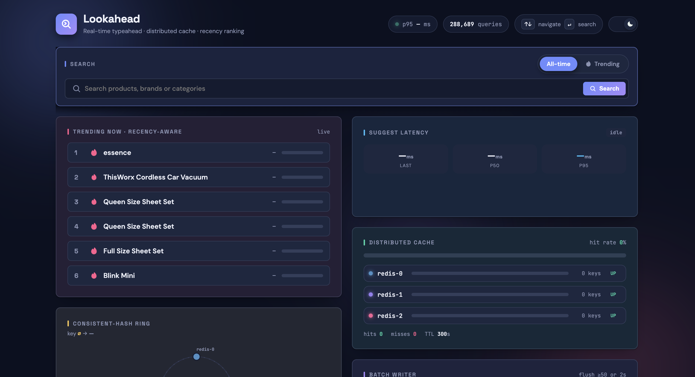
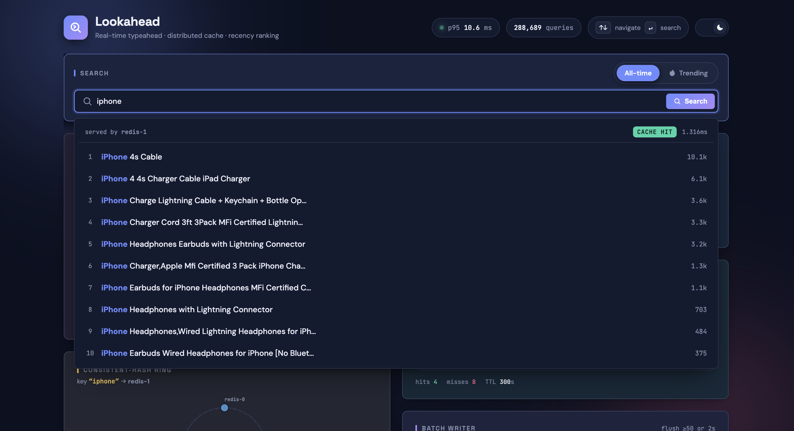
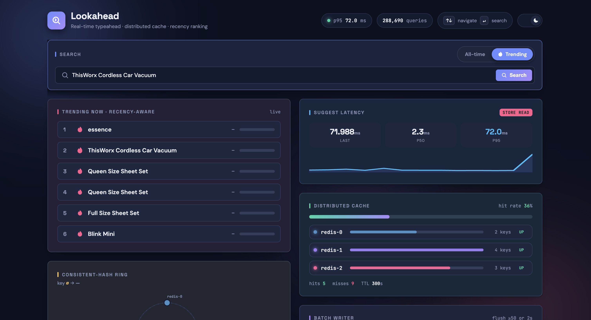
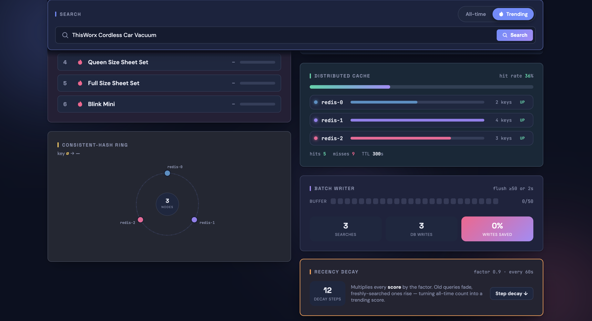
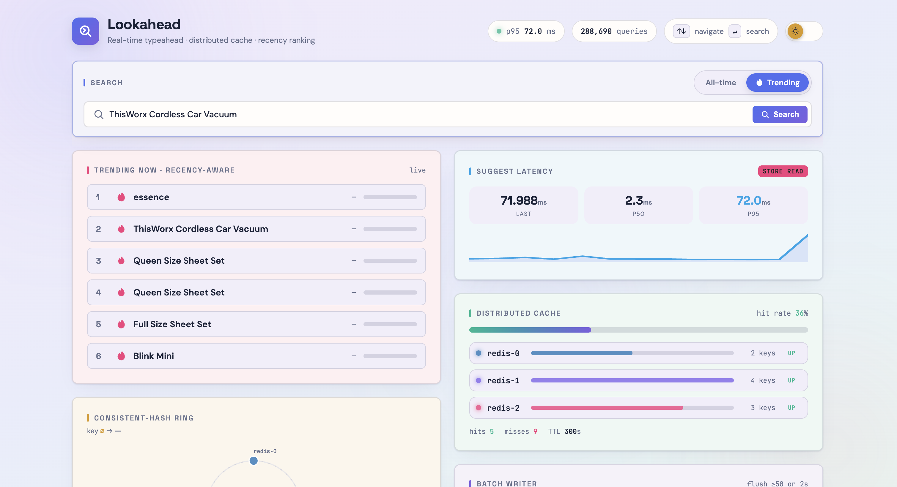

# Lookahead - Search Typeahead System

A search typeahead engine (HLD101 assignment): prefix suggestions sorted by popularity, a
distributed Redis cache with **consistent hashing**, **batch writes**, and recency-aware
**trending** - plus a live dashboard. A durable Search Frequency DB (SQLite) is fronted by a
distributed suggestion cache (Redis) keyed by prefix.

- **Backend:** Node 25 (runs TypeScript natively) · Fastify · built-in `node:sqlite` · Redis (ioredis)
- **Frontend:** single-page dashboard (`web/`), served by the backend
- **Docs:** [`REPORT.md`](./REPORT.md) (architecture, API, design trade-offs, performance) · [`docs/db/schema.dbml`](./docs/db/schema.dbml)

## Architecture


## Screenshots

The live dashboard (PNGs live in `docs/screenshots/`):

| Dashboard overview | Typeahead dropdown — node · hit/miss · latency |
|---|---|
|  |  |
| Trending (recency ranking) | System internals — cache · batch · ring |
|  |  |

**Light theme** (persisted via localStorage):



---

## Quick start

You can run it **with Docker** (easiest) or **locally**. Either way you end up at
**http://localhost:3000**.

### Option A - Docker (recommended)

**Prerequisites:** Docker Desktop.

```bash
# 1. from the project root
cd hld

# 2. build the image + start 3 Redis nodes + the app
docker compose up --build
#    → open http://localhost:3000   (Ctrl+C to stop the logs)

# 3. stop everything
docker compose down
```

That's it - the prebuilt database in `data/typeahead.db` is mounted automatically, so **no
ingestion step is needed**. (Only publishes port 3000; the 3 Redis nodes stay internal.)

> **Fresh machine with no `data/typeahead.db`?** Load the dataset first (see [Dataset](#dataset)),
> then `docker compose up --build`.

### Option B - Local (Node + Redis)

**Prerequisites:** **Node 25+** (uses native TS execution + built-in `node:sqlite`) and
**Redis** (`brew install redis`).

```bash
# 1. install dependencies
npm install

# 2. start 3 local Redis cache nodes (ports 6379 / 6380 / 6381)
npm run redis:start

# 3. load the dataset into SQLite (once - see Dataset section)
npm run ingest

# 4. start the API + dashboard
npm start
#    → open http://localhost:3000

# stop Redis when done
npm run redis:stop
```

Use `npm run dev` instead of `npm start` for auto-reload during development.

---

## Dataset

**Source:** [Amazon Products Dataset 2023 (1.4M Products)](https://www.kaggle.com/datasets/asaniczka/amazon-products-dataset-2023-1-4m-products)
- `title` → search query, `reviews` → popularity count. After filtering `reviews > 0` and
aggregating duplicate titles you get **~288,682 queries** (≈3× the 100k minimum).

**Load it (only needed if `data/typeahead.db` is missing):**

```bash
# 1. get a Kaggle API token: kaggle.com → Settings → API → Create New Token
#    save it to ~/.kaggle/kaggle.json   (chmod 600)

# 2. download + unzip into data/
mkdir -p data
kaggle datasets download -d asaniczka/amazon-products-dataset-2023-1-4m-products -p data
unzip -o data/amazon-products-dataset-2023-1-4m-products.zip amazon_products.csv -d data/

# 3. ingest  (local)         OR  (docker)
npm run ingest               #     docker compose run --rm app npm run ingest
```

`data/` (CSV, zip, SQLite DB) is git-ignored - it's never committed.

---

## Using the dashboard

- **Type** in the search box → suggestions appear (debounced); the dropdown shows which
  **cache node** served it, **hit/miss**, and **latency**.
- Toggle **All-time ↔ Trending** to switch ranking (`rank=count` vs recency-decayed `rank=recent`).
- **Enter** or click a suggestion → records the search (buffered for a batched write).
- Watch the live panels: **Trending**, **Consistent-Hash Ring**, **Latency** (p50/p95),
  **Distributed Cache** (hit rate + per-node keys), **Batch Writer** (write-savings), **Decay**.
- Your recent searches are kept **client-side** (localStorage) and merged above global results.

---

## API (summary)

Full docs + examples in [`REPORT.md` §3](./REPORT.md).

| Endpoint | Purpose |
|---|---|
| `GET /suggest?q=<prefix>&rank=count\|recent` | top-10 suggestions (cache-aside) |
| `POST /search` `{query}` | dummy response + buffer count update |
| `GET /cache/debug?prefix=&rank=` | which node owns a prefix + hit/miss |
| `GET /trending?rank=&limit=` | global top-N |
| `GET /cache/stats` · `GET /batch/stats` · `GET /decay/stats` | live metrics |
| `POST /batch/flush` · `POST /decay/run` | demo controls |
| `GET /health` | liveness |

```bash
curl 'http://localhost:3000/suggest?q=iphone&rank=count'
curl -X POST localhost:3000/search -H 'Content-Type: application/json' -d '{"query":"iphone 15"}'
```

---

## Tests

```bash
npm test     # 17 tests via node:test - ring, normalize, cache-aside, batch, decay, fail-open
```

---

## Configuration (env vars)

| Var | Default | Meaning |
|---|---|---|
| `PORT` | `3000` | HTTP port |
| `REDIS_NODES` | localhost `6379,6380,6381` | comma-separated `host:port` cache nodes (set by Docker) |
| `CACHE_TTL_SECONDS` | `300` | suggestion cache TTL |
| `BATCH_SIZE` | `50` | flush after N buffered searches |
| `FLUSH_INTERVAL_MS` | `2000` | flush timer |
| `DECAY_FACTOR` / `DECAY_INTERVAL_MS` | `0.9` / `60000` | recency decay |
| `SAMPLE_EVERY` | `1` | ingest: keep 1-in-N qualifying rows |

---

## Project structure

```
src/
  normalize.ts   shared query normalization
  db.ts          SQLite Frequency DB (query → count, score) + shared upsert
  ingest.ts      dataset loader (CSV → filter → aggregate → SQLite)
  ring.ts        consistent-hashing ring (virtual nodes)
  cache.ts       DistributedCache over Redis nodes (+ in-memory node for tests)
  suggest.ts     cache-aside suggestion serving + trending
  batch.ts       buffer + aggregate + flush (batch writes)
  decay.ts       periodic recency decay
  config.ts      env-driven configuration
  server.ts      Fastify routes + static dashboard
web/             dashboard (index.html, app.js)
tests/           node:test suite
docker/app/      Dockerfile
scripts/         redis start/stop
```

---

## Notes
- Suggestions are **prefix matches on product titles** (typeahead semantics) - a query shows
  only if a title *starts with* what you typed.
- Counts/cache are **server-side** (shared); only theme + recent searches live in the browser.

---

Built by [Manasvi-247](https://github.com/Manasvi-247).
