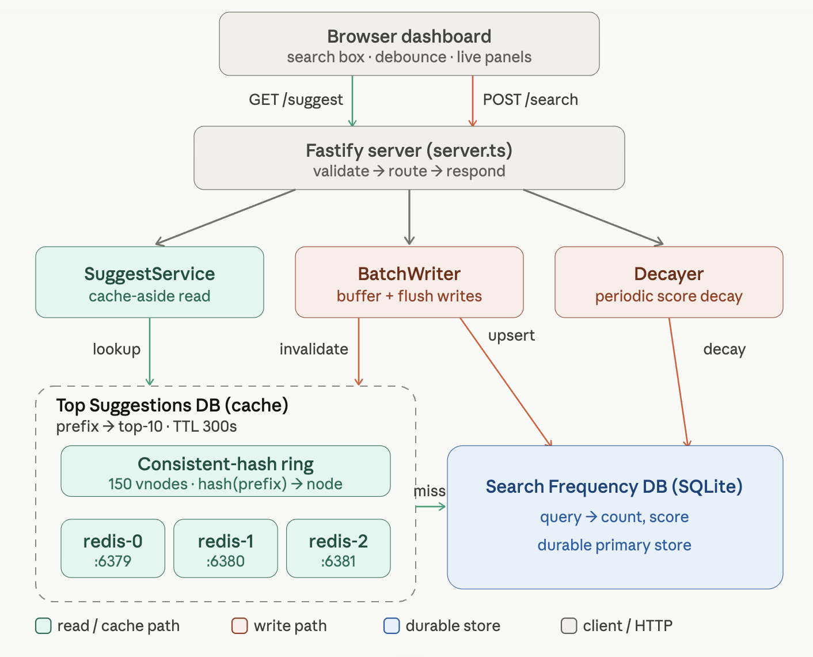

# Search Typeahead - Project Report

**Course:** SST-2028 / HLD101 · **Assignment:** Build a Search Typeahead System
**Author:** [Manasvi-247](https://github.com/Manasvi-247)
**Stack:** Node 25 (native TypeScript) · Fastify · `node:sqlite` · Redis (ioredis) · vanilla-JS dashboard

This system serves popular search suggestions for a typed prefix at low latency. The design is a **two-store** model: a durable **Search Frequency DB** (SQLite) holds `query → count/score`, and a **distributed suggestion cache** (Redis, 3 nodes routed by consistent hashing) holds the top-k suggestions for each prefix. The cache key *is* the prefix — so the per-prefix top-k that an in-memory trie would precompute is instead stored as a distributed cache, keeping reads fast and the cache horizontally scalable.

---

## 1. Architecture

### 1.1 Diagram

```
                                  ┌──────────────────────────────────────────────┐
                                  │            Browser dashboard (web/)            │
                                  │  search box · debounce · ↑↓↵ · trending ·      │
                                  │  ring viz · latency · cache · batch · decay    │
                                  │  localStorage: theme + recent searches         │
                                  └───────────────┬───────────────┬───────────────┘
                            GET /suggest?q=&rank=  │               │  POST /search {query}
                            GET /cache/* /trending │               │
                                                   ▼               ▼
                                  ┌──────────────────────────────────────────────┐
                                  │              Fastify server (src/server.ts)    │
                                  │   validate → route → service → return          │
                                  └───┬──────────────┬───────────────┬────────────┘
                                      │              │               │
                       ┌──────────────▼───┐   ┌──────▼───────┐   ┌───▼──────────────┐
                       │ SuggestService   │   │ BatchWriter  │   │ Decayer          │
                       │ (cache-aside)    │   │ (buffer+flush)│  │ (periodic decay) │
                       └───┬──────────┬───┘   └──────┬───────┘   └───┬──────────────┘
            consistent-hash│          │ miss         │ flush          │ UPDATE score*=f
            hash(prefix)   │          │ (compute)    │ (aggregated)   │
                  ┌────────▼───────┐  │              │                │
                  │ HashRing       │  │              │                │
                  │ 150 vnodes/node│  │              ▼                ▼
                  └───┬───┬───┬────┘  │   ┌────────────────────────────────────┐
                      ▼   ▼   ▼        └──▶│  SQLite - Search Frequency DB       │
                 ┌──────┐┌──────┐┌──────┐ │  queries(query PK, display, count,  │
                 │redis0││redis1││redis2│ │           score)                     │
                 │ 6379 ││ 6380 ││ 6381 │ │  (the durable primary store)         │
                 └──────┘└──────┘└──────┘ └────────────────────────────────────┘
                  Top Suggestions DB (cache)   ▲
                  prefix → top-10 (JSON, TTL)   │ invalidate affected prefixes on flush
                                                └──────────────── BatchWriter
```

### 1.2 Components

| Component | File | Role |
|---|---|---|
| **Normalizer** | `src/normalize.ts` | One canonical `query` form (lowercase, trim, collapse spaces). Used identically at ingest + query time so prefixes line up. Handles mixed-case input. |
| **Search Frequency DB** | `src/db.ts` | SQLite (`node:sqlite`). `queries(query PK, display, count, score)`. The durable primary store - counts only, not suggestion lists. |
| **Ingestion** | `src/ingest.ts` | Streams the dataset CSV → filter → aggregate → load. |
| **Consistent-hash ring** | `src/ring.ts` | 2³² ring, 150 virtual nodes/node, md5 hash, clockwise lookup. Decides which cache node owns a prefix. |
| **Distributed cache** | `src/cache.ts` | `DistributedCache` over 3 Redis nodes (`RedisCacheNode`) behind a `CacheNode` interface (swappable; `InMemoryCacheNode` for tests). The "Top Suggestions DB". |
| **Suggestion serving** | `src/suggest.ts` | Cache-aside read path: ring → Redis → hit; miss → prefix range scan on SQLite → cache with TTL. Fail-open on cache errors. |
| **Batch writer** | `src/batch.ts` | Buffers `/search` events, aggregates repeats, flushes to SQLite + invalidates affected prefixes. |
| **Decayer** | `src/decay.ts` | Periodically multiplies every `score` by a factor - turns all-time count into a recency-aware score. |
| **HTTP + static** | `src/server.ts` | Fastify routes + serves the dashboard (`web/`). |
| **Dashboard** | `web/index.html`, `web/app.js` | The UI; talks to the API on the same origin. |

### 1.3 The two-store model (why)

The suggestions for a prefix are just the top-k matching queries. An in-memory augmented trie could precompute that, but the per-prefix top-k **is** exactly a cache keyed by prefix — so we store it as a separate distributed cache instead of maintaining a trie:

- **SQLite (Frequency DB)** - durable `query → count/score`. Never holds suggestion lists.
- **Redis (Top Suggestions DB)** - `prefix → top-10`, distributed across 3 logical nodes via consistent hashing, with a TTL.

On a cache **miss** we compute the prefix's top-10 from SQLite with an **indexed range scan** (`WHERE query >= :lo AND query < :hi ORDER BY count|score DESC LIMIT 10`), write it back to the cache, and return it. The cache absorbs repeat reads, satisfying the assignment's "use a cache before falling back to the primary data store".

---

## 2. Dataset

### 2.1 Source

**Amazon Products Dataset 2023 (1.4M Products)** - Kaggle: `asaniczka/amazon-products-dataset-2023-1-4m-products` (ODC-By license).

- Columns: `asin, title, imgUrl, productURL, stars, reviews, price, listPrice, category_id, isBestSeller, boughtInLastMonth`.
- **`query = title`**, **`count = reviews`** (popularity proxy).
- `reviews` chosen over `boughtInLastMonth` after measuring: across the full 1.4M rows `reviews > 0` for ~295,834 rows vs `boughtInLastMonth > 0` for far fewer; `reviews` has a wide range (0-292k+) → a realistic popularity distribution.

### 2.2 Loading instructions

```bash
# 1. Get a Kaggle API token (kaggle.com → Settings → API → Create New Token)
#    Place it at ~/.kaggle/kaggle.json  (chmod 600), OR export KAGGLE_API_TOKEN=...

# 2. Download + unzip into data/
mkdir -p data
kaggle datasets download -d asaniczka/amazon-products-dataset-2023-1-4m-products -p data
unzip -o data/amazon-products-dataset-2023-1-4m-products.zip amazon_products.csv -d data/

# 3. Ingest into SQLite
npm run ingest          # SAMPLE_EVERY=1 keeps all qualifying rows (default)
```

`ingest.ts` streams the CSV (`csv-parse`), keeps rows with `reviews > 0`, normalises the title to the canonical `query`, and **aggregates duplicate titles** (counts summed - the assignment's "derive counts by aggregation"). `score` is seeded equal to `count`.

**Result (measured):**
- Rows read: **1,426,337**
- Qualifying (`reviews > 0`): **295,834**
- Unique queries loaded: **288,682** (≈ 2.9× the 100k minimum)
- Count range: **1 - 346,563**

Configurable via env: `SAMPLE_EVERY` (keep 1-in-N qualifying rows), `CSV_PATH`.

---

## 3. API documentation

Base URL `http://localhost:3000`. JSON responses; every response carries an `x-request-id` header; errors use a consistent envelope `{ "error": { code, message, request_id } }`.

| Method & path | Purpose | Key params | Response (shape) |
|---|---|---|---|
| `GET /suggest` | Typeahead suggestions (cache-aside) | `q` (prefix), `rank=count\|recent` | `{ query, rank, cache:"hit\|miss\|skip", node, latencyMs, count, suggestions:[{query,count,score}] }` |
| `POST /search` | Dummy search + buffer count update | body `{ query }` | `{ "message":"Searched", query }` |
| `GET /cache/debug` | Which node owns a prefix + hit/miss | `prefix`, `rank` | `{ prefix, rank, key, node, status:"HIT\|MISS", ring:[...] }` |
| `GET /trending` | Global top-N (no prefix) | `rank`, `limit` | `{ rank, suggestions:[...] }` |
| `GET /cache/stats` | Hit rate + per-node key counts | - | `{ hits, misses, hitRate, datasetSize, ttl, nodes:[{id,keys,ok}] }` |
| `GET /batch/stats` | Write-reduction evidence | - | `{ totalEvents, totalDbWrites, writesSavedPct, pendingEvents, batchSize, flushIntervalSec, pending:[{q,n}] }` |
| `POST /batch/flush` | Force a flush (demo) | - | batch stats |
| `GET /decay/stats` | Decay factor/interval/steps | - | `{ runs, factor, intervalMs }` |
| `POST /decay/run` | Apply one decay step (demo) | - | decay stats |
| `GET /health` | Liveness | - | `{ ok:true }` |
| `GET /` | Dashboard SPA (static) | - | HTML |

### Examples
```bash
curl 'http://localhost:3000/suggest?q=iphone&rank=count'
# {"query":"iphone","rank":"count","cache":"miss","node":"redis-2","latencyMs":3.04,"count":10,"suggestions":[...]}

curl -X POST localhost:3000/search -H 'Content-Type: application/json' -d '{"query":"iphone 15"}'
# {"message":"Searched","query":"iphone 15"}

curl 'http://localhost:3000/cache/debug?prefix=iphone'
# {"prefix":"iphone","rank":"count","key":"sug:count:iphone","node":"redis-2","status":"HIT","ring":["redis-0","redis-1","redis-2"]}
```

**Validation/authz:** inputs are validated (empty/over-`MAX_QUERY_LEN` → 400). The read/search API is **public** (Google's typeahead is public; authentication is an assumed dependency, out of scope for this design). The operational endpoints (`/batch/flush`, `/decay/run`) would be admin-gated in production.

---

## 4. Design choices & trade-offs

Non-functional requirements drive these choices:

| Decision | Rationale | Trade-off |
|---|---|---|
| **Eventual consistency** | Users don't know/care about true counts; strict order not needed. | A query's new count can take until the next flush / TTL to show. Accepted. |
| **Cache-aside + TTL (300s)** | Read-heavy system → "absorb reads in a cache". Hit ≈ 0.3 ms. | First request per prefix is a slower miss; broad prefixes ("a" → 13,695 rows) sort on miss. Then cached. |
| **Two stores (SQLite + Redis)** | "data-augmentation == cache". | Cache can be stale vs DB within TTL/flush window - acceptable per NFRs. |
| **Consistent hashing (150 vnodes)** | Routes prefix→node with minimal remapping when nodes change. | More vnodes = better balance, more memory. 150 is a standard middle ground. |
| **Batch writes** | Avoid 1 DB write + ~10 cache writes per search; buffer + aggregate + flush. | **Crash before flush loses buffered counts** → counts off by a small amount (acceptable). Clean shutdown flushes; prod mitigation = WAL / shorter interval. |
| **Recency via decay** | `score = 0.9·old + today`; old queries fade, fresh ones rise. | Periodic full-table `UPDATE` is O(rows) and synchronous (see §5). Run as a background job at scale. |
| **Prefix range scan, not LIKE `%…%`** | Uses the `query` PK index; avoids the anti-pattern. | Only matches titles that **start with** the prefix (typeahead semantics), not mid-title. |
| **No index on `score`** | The prefix suggest queries filter by the `query` PK range then sort the small matched set, so a `score` index doesn't help **them**. | Dropped to save write cost on every search + decay. Caveat: `GET /trending?rank=recent` does a full scan + top-k sort over all rows — infrequent, small `LIMIT`, so acceptable; add `idx_queries_score` if trending-by-score becomes hot. |
| **`node:sqlite` + native TS (Node 25)** | Zero native-build dependency; runs `.ts` directly. | Bleeding-edge Node; `node:sqlite` is synchronous (blocks the event loop on big writes - see §5). |
| **Cache fail-open + command timeout** | A cache failure must not cascade into request failures. | If Redis is down, `/suggest` silently serves from SQLite (slower) instead of erroring. |
| **Client-side personalization (localStorage)** | "Do personalization purely on the client side; browser merges local + global lists". | Per-device only; not shared. That's the point (privacy + zero backend write). |

**Scale note:** at true scale (≈10M typeaheads/s, ≈160 TB, sharding mandatory) this would run across many sharded cache servers. This project is a **local single-machine demo of the same patterns**; to scale, add more shards.

---

## 5. Performance report

Measured locally (single machine, single Node process, 3 local Redis instances, 288,682 queries). Reproduce with the commands noted.

### 5.1 Suggestion latency
| Path | Latency | Note |
|---|---|---|
| Cache **hit** | **~0.28 ms** | served from Redis; well under the <10 ms typeahead target |
| Cache **miss** (compute from SQLite) | **~3.0 ms** | prefix range scan + sort, then cached |
| Narrow-prefix DB scan | 0.4-2.3 ms | e.g. `iphone` |
| Broad-prefix miss (`a` → 13,695 rows) | higher (one-off) | sorts the matched set once, then cached |

> p50/p95 are also computed live in the dashboard's Latency panel from real `latencyMs` samples. Reproduce: type in the UI, or `curl '…/suggest?q=iphone'` twice (miss then hit).

### 5.2 Cache
- Hit/miss counters + hit-rate and per-node key counts exposed at `GET /cache/stats` and visualised in the dashboard.
- TTL = 300 s (configurable `CACHE_TTL_SECONDS`).
- **Invalidation N+1 fixed:** flush deletes are grouped by owning node → **one variadic `DEL` per node (≤3 commands)** instead of one `DEL` per key.

### 5.3 Consistent hashing (balance + remap)
Over 20,000 keys across 3 nodes: ~31.7% / 36.7% / 31.6%. **Adding a 4th node remapped only 22.6%** of keys (ideal ≈ 25%), and **every moved key went to the new node** - proving existing assignments aren't reshuffled. Reproduce: `npm test` (`tests/ring.test.ts` asserts the minimal-remap property — a 4th node moves <40% of keys, and only to the new node).

### 5.4 Batch writes (write reduction)
- 40 identical searches buffered → **1 aggregated DB write** on flush (40→1).
- Cumulative example: **45 events → 2 DB writes ≈ 22.5× reduction**; live `writesSavedPct` at `GET /batch/stats`.
- Triggers verified: by size (`BATCH_SIZE`), by interval (`FLUSH_INTERVAL_MS`), manual, and on graceful shutdown.

### 5.5 Decay cost (known limitation)
- One decay step = `UPDATE queries SET score = score * 0.9` over 288k rows ≈ **0.7 s**, and because `node:sqlite` is synchronous it briefly **blocks the event loop**. Fine for a 60 s interval demo; at scale this is a background job (the algorithm - uniform multiply - is unchanged; it's purely operational).

---

## 6. Testing

`npm test` - 17 tests via Node's built-in `node:test` (no external deps), following the standard test pyramid:
- **Unit:** ring (distribution, determinism, minimal remap, wrap-around), `normalize`, `prefixUpperBound`.
- **Integration** (in-memory SQLite + injected `InMemoryCacheNode`): cache-aside (miss→set→hit), mixed-case, empty input, rank ordering, **fail-open** (cache errors still return DB results), batch aggregation + dual-rank invalidation, decay order-preservation.

---

## 7. How to run

**Docker (recommended)** — one command brings up the app + all 3 Redis nodes:
```bash
docker compose up --build    # dashboard + API at http://localhost:3000
docker compose down          # stop
```
The prebuilt `data/typeahead.db` is mounted via a volume, so no ingest step is needed. Only port 3000 is published; the 3 Redis nodes stay internal, and `REDIS_NODES` points the app at the Redis containers. Image: multi-stage `docker/app/Dockerfile` (slim `node:25` base, non-root, healthcheck); orchestration: `docker-compose.yml` (app + redis-0/1/2 with health-gated startup).

**Local (Node 25 + Redis):**
```bash
npm install
npm run redis:start     # 3 Redis nodes on 6379/6380/6381
npm run ingest          # load dataset into SQLite (once; see §2)
npm start               # API + dashboard at http://localhost:3000
npm test                # run the test suite
npm run redis:stop      # stop the 3 nodes
```

---

## 8. Architecture diagram



This mirrors the ASCII overview in §1.1: the browser hits Fastify, which fans out to
SuggestService (cache-aside read), BatchWriter (buffered writes), and Decayer; the
distributed Redis cache (consistent-hash ring over redis-0/1/2) fronts the durable SQLite
Search Frequency DB.
